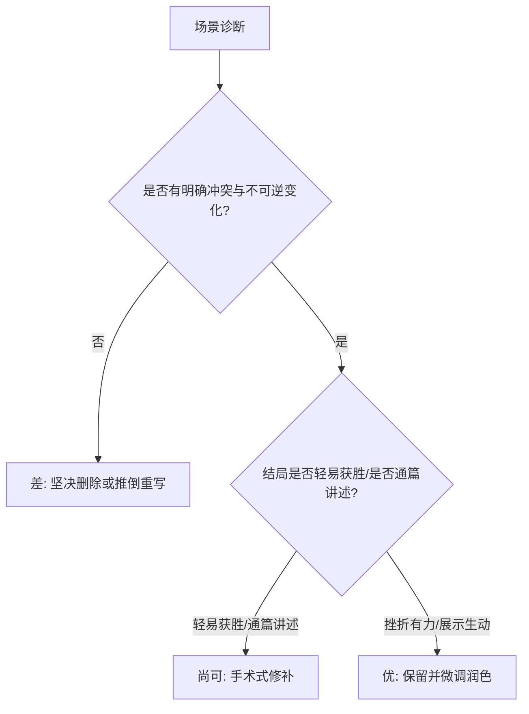

# 手稿诊断与十大拒稿排查手册（Novel Revision & Diagnostics）

> “初稿只是你给自己讲故事的过程，修改才是让故事属于读者的真正艺术。如果你不知道手稿病在何处，你的修改就只是在盲目地挪动家具；而一旦你掌握了诊断工具，你就能像外科医生一样精准下刀。” —— 兰迪·英格曼森

---

## 阶段一：场景级三分类诊断法（Scene Triage）

通读每一个场景时，给其打上三种标签之一：**优（Keep）**、**差（Kill）**、**尚可（Fix）**。

### 1. 判定为“优（Keep）”的黄金标准
- 拥有且仅有一个清晰的**视点人物（POV）**，视角牢牢锁定。
- 视点人物带着明确、紧迫、具体的目标进入场景。
- 遭遇了层层加码的顽固阻力，经历了至少 2 次拉锯。
- 场景以扣人心弦的挫折（`No` / `No, and furthermore` / `Yes, but`）告终。
- 通篇大量调用 5 大展示工具，读者产生了强烈的代入与生理共鸣。

### 2. 判定为“差（Kill）”的病理特征（坚决切除）
- **茶话会废章**：两个人物在安全环境下边喝茶边互相交代过去的背景设定，没有任何实质性利益冲突。
- **观光说明书**：作者花费数千字详尽描写宏大的异界城堡或宗门建筑，但人物在其中没有任何行动与目标。
- **处方**：直接整章删除，若其中包含关键设定信息，提炼为 1-2 句叙事概要插入到后续的高压冲突场景中。

### 3. 判定为“尚可（Fix）”的常见病症与外科手术方案

| 场景类型 | 常见病症 | 外科手术方案 |
| :--- | :--- | :--- |
| **主动型** | **目标模糊**（人物不知道要干啥，随波逐流） | 强化动机：赋予人物一个必须在 15 分钟内解决的具象死线（Dead-line）。 |
| **主动型** | **对手太弱**（主角轻易碾压，无戏剧张力） | 给对手加码：让对手识破主角策略、引入环境突发恶化或增加第三方搅局。 |
| **主动型** | **胜利太顺**（主角全盘通关，读者兴趣归零） | 植入毒苹果结局：改为 `Yes, but...`（拿到了解药，但瓶身已经碎了，只剩半柱香时间）。 |
| **反应型** | **木头人综合征**（受重创后毫无生理反应） | 补齐内脏生理链：插入心跳漏跳、冷汗、胃部痉挛与粗粝原声内心独白。 |
| **反应型** | **虚假两难**（表面纠结，其实有明显的最优解） | 关死逃生门：把最优解彻底封死，让人物必须在两块烧红的烙铁中抓起一块。 |
| **全类型** | **视角乱跳（Head-Hopping）** | 剔除上帝视角：将非视点角色的内心描写全部抹去，仅通过动作、表情与声音由视点角色观察推测。 |

---

## 阶段二：出版方与编辑拒稿十大致命雷区排查

根据《如何写出一篇好小说》第十七章，以下是导致作品被编辑退稿或被读者弃书的 **10 大终极死穴**：

### 1. 编辑/平台类型不匹配（Genre Mismatch）
- **症状**：把慢节奏纯文学写法投给番茄爽文，或把硬核修仙投给浪漫言情。
- **排查**：是否深刻理解了所在平台的核心诉求与受众心理预期？

### 2. 技巧平庸与缺乏打磨（Mediocre Technique）
- **症状**：到处都是错别字、病句、语法失控、视角频繁跳跃、标点符号乱用。
- **排查**：手稿是否完成了基础的文字校对与段落呼吸重整？

### 3. 目标读者群不明确（Unclear Target Audience）
- **症状**：既想讨好重度老白书友，又想迎合轻度快餐爽文读者，四不像。
- **排查**：能否在 30 秒内用三句话清晰描述出你的“最核心付费读者画像”？

### 4. 故事世界陈词滥调（Boring Story World）
- **症状**：修仙就是千篇一律的灵根宗门拍卖行，末世就是千篇一律的丧尸避难所，缺乏独创的“地方感（Sense of Place）”。
- **排查**：是否为你设定的世界构筑了独特的文化压迫感与阶层运行逻辑？

### 5. 核心故事线无力（Weak Story Hook / Logline）
- **症状**：无法用一句 25 字以内的话勾住编辑的兴趣；讲起故事来支支吾吾需要解释半小时。
- **排查**：按照雪花第一步公式重新打磨你的 Logline，直到任何人在 5 秒内听完都能双眼放光。

### 6. 人物脸谱化、不独特（Flat, Boring Characters）
- **症状**：主角是完美的正义道德模范，反派是莫名其妙就嘲讽送经验的降智脑残。
- **排查**：查阅[人物宝典](../resources/character_bible_template.md)，是否为每个人物注入了过往创伤、相互冲突的价值观与不可告人的秘密？

### 7. 作者缺乏强烈风格与辨识度（Lack of Strong Voice）
- **症状**：文笔像标准说明书一样冰冷平滑，毫无句式长短错落与语言质感，充满 AI 的“讲义腔”。
- **排查**：通过大量短句切割、高频动词运用与独特隐喻，建立冷峻、凌厉或诙谐的辨识度。

### 8. 情节可预测（Predictable Plot）
- **症状**：读者看开头就能猜中结尾，每一个转折都在意料之中。
- **根本原因**：
  - 研究不足，照搬影视剧老套路；
  - 人物价值观单一，没有伦理冲突；
  - 场景中的挫折不够致命，主角总能全身而退。

### 9. 主题说教压倒一切（Overbearing Preachy Theme）
- **症状**：作者借主角之口大段发表人生大道理与道德演说，全书充满居高临下的布道感。
- **排查**：**绝不说教**！让主题退居幕后，让不同的价值观在残酷的抉择中自然对撞，结论交由读者得出。

### 10. 【终极死穴】未能给读者带来强烈的心理与情感体验
- **致命病理**：无论设定多宏大、大纲多精巧，读者阅读时内心毫无波澜，既不紧张，也不感动，更无期待。
- **终极救治三策**：
  1. **大幅提高生死与存亡赌注（Raise the Stakes）**：让失败的代价不可承受；
  2. **撕裂人物的执念（Attack the Core Values）**：击碎主角最珍视的依仗；
  3. **把控主动/反应节拍**：绝不给主角长时间的安逸，刚脱狼口，立入虎穴。
