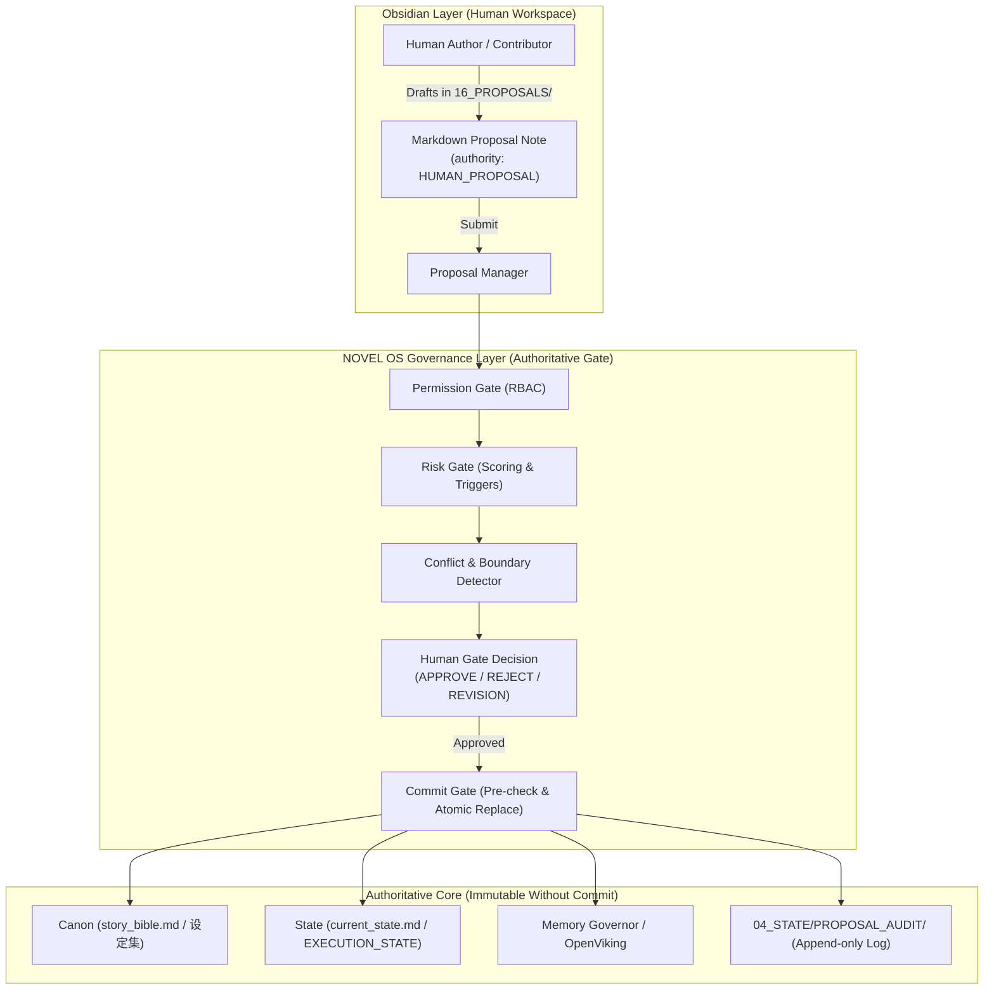
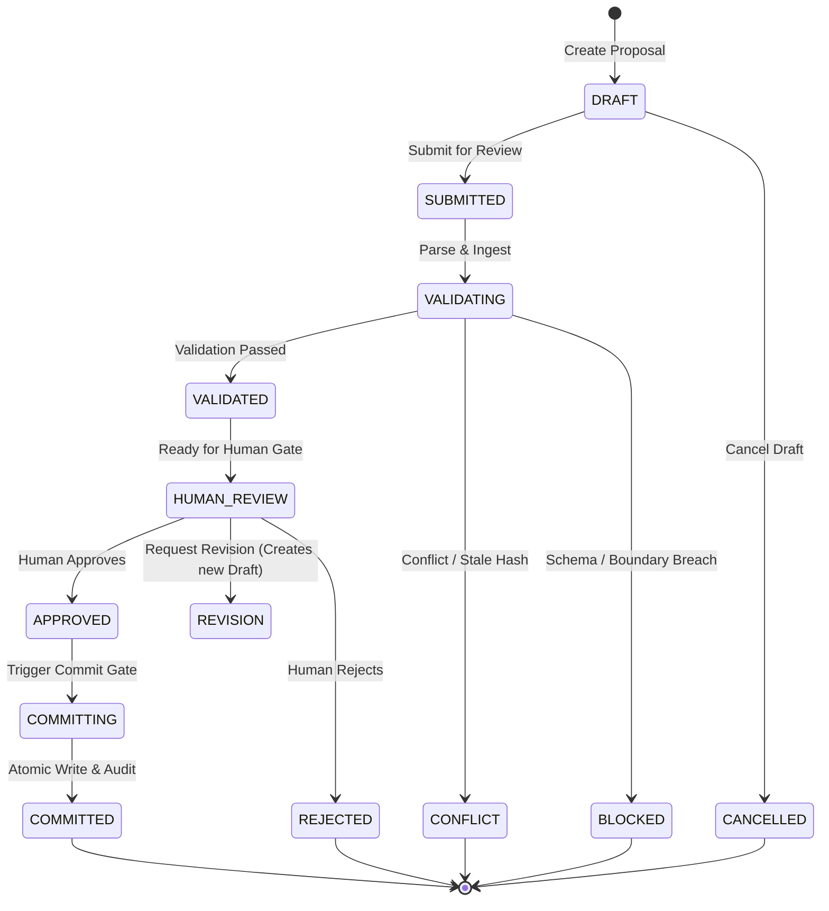

# NOVEL OS V2.3 — PHASE 2C 提案系统架构设计
## PROPOSAL SUBSYSTEM ARCHITECTURE & SPECIFICATION

---

### 一、架构设计理念 (Architecture Core Philosophy)

在 NOVEL OS V2.3 体系中，Obsidian 被定义为 **人类知识与视觉评审工作区 (Human Knowledge Workspace)**，绝非自动化 Agent 的主脑或设定权威。

Phase 2C 将 Obsidian 从单纯的“只读镜像”升级为 **“人类提案工作区 (Human Proposal Workspace)”**，其核心铁律为：

$$\text{PROPOSAL} \neq \text{FACT}$$

提案在未经过正式校验、冲突检测、Human Gate 决策和原子提交之前，**绝对不具备设定效力**。



---

### 二、提案生命周期状态机 (Lifecycle State Machine)



---

### 三、模块职责与代码布局 (Component Structure)

```text
scripts/obsidian_adapter/proposals/
├── __init__.py                # Package facade
├── proposal_schema.py         # Proposal dataclass, enums, 28-field schema
├── proposal_parser.py         # Bidirectional markdown serializer & parser
├── proposal_permission.py     # RBAC permission gate against PERMISSION_MATRIX.yaml
├── proposal_risk.py           # Risk assessment & scoring against RISK_GATE.yaml
├── proposal_conflict.py       # Hard canon conflict & knowledge boundary validator
├── proposal_provenance.py     # Provenance tracking & lineage verification
├── proposal_state.py          # State machine transitions & revision manager
├── proposal_commit.py         # Pre-commit checks & atomic file committer
├── proposal_audit.py          # Append-only JSONL audit logger (04_STATE/PROPOSAL_AUDIT/)
└── proposal_manager.py        # Master coordinator & Vault directory manager
```

---

### 四、Vault 目录隔离规范 (Directory Isolation)

所有提案文件物理隔离在 `NOVEL_OS_VAULT/16_PROPOSALS/` 目录树下：

```text
NOVEL_OS_VAULT/
└── 16_PROPOSALS/
    ├── 00_INBOX/        # 新建或未分类提案
    ├── 01_DRAFT/        # 正在编辑的草稿提案 (DRAFT)
    ├── 02_SUBMITTED/    # 已提交正在校验的提案 (SUBMITTED / VALIDATING)
    ├── 03_REVIEW/       # 校验通过等待人类决策的提案 (HUMAN_REVIEW)
    ├── 04_APPROVED/     # 人类批准待提交提案 (APPROVED)
    ├── 05_REJECTED/     # 人类驳回或冲突阻断提案 (REJECTED / CONFLICT / BLOCKED)
    ├── 06_COMMITTED/    # 已原子提交生效的提案 (COMMITTED)
    ├── 99_ARCHIVE/      # 已归档或作废的历史提案
    └── README.md        # 人类提案工作区操作说明
```
