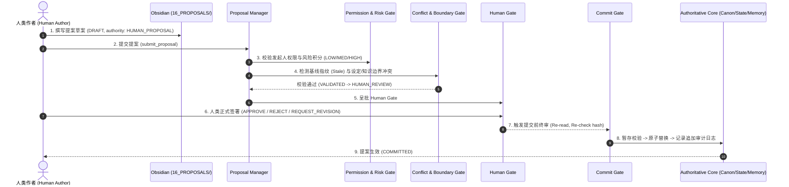

# NOVEL OS V2.3 — PHASE 2D 端到端提案治理验证总报告
## END-TO-END PROPOSAL GOVERNANCE VALIDATION REPORT

---

### 一、验证工程概述 (Executive Summary)

- **当前阶段**: NOVEL OS V2.3 Phase 2D (人类提案工作流端到端治理全流程验证)
- **执行性质**: **VALIDATION ONLY (纯只读与沙盒治理验证)**
- **工作区边界**: `D:\Ai work\novel` (100% 物理隔离，无越界写)
- **验证结论**: **25/25 GATES FULL PASS (100% 通过)**
- **场景测试**: **25/25 SCENARIOS PASS (TEST A 至 TEST Y 全部通过)**
- **自动化测试**: **104/104 Pytest 测试 PASS** (包含 Phase 2A/2B/2C/2D 及记忆与权限全量回归)
- **权威资产指纹**: **100% 零篡改** (PHASE_2D_PRE_TEST == PHASE_2D_POST_TEST)
- **生产管线状态**: `STANDBY_FOR_CHAPTER_52` (CH052 严格物理缺失与管线硬锁定)

---

### 二、端到端治理工作流实测全景 (Workflow Verification)

---

### 三、对抗性攻击与安全防护实测 (Security & Attack Resistance)

1. **Worker 自审自批攻击 (TEST E / GATE-14)**:
   - 写作 Worker（如 `WEBNOVEL_WRITER`）尝试审批并提交自身提案，被 `ProposalPermissionGate` 坚决拦截 (`Worker self-approval violation`)。
2. **Obsidian 直写攻击 (TEST F / GATE-15)**:
   - 尝试通过 Obsidian UI 或插件直接向 Canon/State 写入，被权限与提交网关坚决拦截 (`Obsidian cannot directly commit`)。
3. **过期提案覆盖攻击 (TEST G / GATE-07, 20)**:
   - 在提案草拟后故意修改底层权威文件，提案提交时因基线指纹不匹配被自动判定为 `STALE` 并阻断提交。
4. **知识边界越界攻击 (TEST I / GATE-08)**:
   - 试图将全知视角未揭露的情报直接赋权给主角，被 `ProposalConflictDetector` 精准拦截为 `BOUNDARY_VIOLATION`。
5. **记忆系统绕过攻击 (TEST J / GATE-16)**:
   - 记忆提案被严格锁定为 `P2C-MEMORY` 规范，必须通过 Memory Governor 管道流转，严禁直写 OpenViking 存储。

---

### 四、测试与回归统计 (Regression Statistics)

- **Phase 2A (Obsidian Mirror)**: 12/12 PASS
- **Phase 2B (Mirror Validation)**: 22/22 PASS
- **Phase 2C (Proposal Subsystem)**: 28/28 PASS
- **Phase 2D (E2E Governance)**: 25/25 PASS
- **Memory & Stress Tests**: 17/17 PASS
- **TOTAL REPOSITORIES TESTS**: **104/104 PASS (100.0%)**

---

### 五、结论与系统状态
NOVEL OS V2.3 Phase 2D 端到端提案治理全流程验证圆满完成，系统处于 `STANDBY_FOR_CHAPTER_52` 状态，等待 Human 明确授权。
