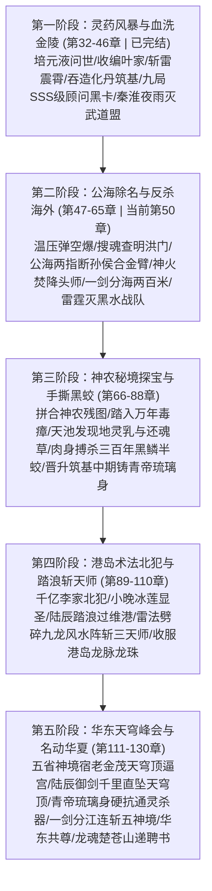

# 第二卷终极详细大纲：名动江南（第 32 - 130 章 | 约 32 万字）

> **所属卷幕**：第二卷（名动江南）· 全篇 99 章  
> **核心战力**：炼气巅峰 ➔ 筑基初期（第42章吞阴阳造化丹达成） ➔ 筑基中期（第86章吞蛟丹地灵乳） ➔ 筑基后期/假丹（第125章华东峰会）  
> **地图跨越**：江海市 ➔ 金陵省城 ➔ 公海万吨游轮 ➔ 神农古秘境 ➔ 港岛维多利亚港 ➔ 中海金茂天穹顶

---

## 🗺️ 第二卷五大进阶阶段全景

---

## 📚 逐阶段详细分章节点规划

### 💥 第一阶段：灵药风暴与血洗金陵（第 32 - 46 章 | 已完结）
* **第 32-36 章**：灵辰集团成立，【培元液】引爆全省；武道盟血色拜帖；废弃钢厂惊鸿飞剑瞬斩十六宗师，叶老太爷率暗卫跪拜认主；灵辰大厦揭牌；雷震霄设局药博会。
* **第 37-39 章**：惊鸿剑升级下品灵器；黑榜杀手幽灵被小晚玄阴寒气废臂；金陵博览会 101 亿截胡五百年紫灵芝；飞剑连斩三宗师枭首雷震霄。
* **第 40-42 章**：云顶引地火炼【阴阳造化丹】，吞丹引动风暴踏入【筑基初期】；九局朱雀小队夜探云顶，冷月折服敬献特级顾问黑卡。
* **第 43-46 章**：苏正国奉上股权；秦淮夜雨陆辰化雨滴为穿甲弹秒杀 300 刀手，踏灭武道盟飞剑斩宗师平定江南；九局盖印【SSS级镇国神话】；暗网挂出 5000 万美金猎杀令。

---

### 🔥 第二阶段：公海除名与反杀海外（第 47 - 65 章 | 即将起草）

#### 第 47-49 章（已完结）
- **第 47 章**：暗影潜江，圣殿佣兵架设巴雷特穿甲狙击，子弹在陆辰周身三寸动能归零，飞剑千米枭首。
- **第 48 章**：战术温压弹凌空袭来，陆辰袖里乾坤拂至千米高空引爆，全歼潜伏佣兵。
- **第 49 章**：搜魂查清海外洪门与医药财阀勾结；孙侯公海折辱九局特勤送来生铁血色战书；陆辰茶梗断生铁战书，下达“备快艇，三日后公海除名”战令。

#### 第 50-52 章（公海万吨游轮决战·极度高潮）
- **第 50 章：踏浪登轮，一指断臂**
  - **CBN**：陆辰乘快艇抵公海维多利亚女王号，踏浪登轮，面对孙侯挑衅，两指折断其重型合金机械臂。
  - **CPNs**：快艇破浪抵公海 ➔ 游轮重火器扫射被护体罡气震碎 ➔ 负手登临顶层甲板 ➔ 孙侯狂妄出拳 ➔ 陆辰两指轻夹将合金臂捏成麻花。
  - **CEN**：孙侯惨叫倒退，南洋两大降头师巴颂与阿赞扎桀桀怪笑，举起婴儿头骨权杖引动整座游轮的“万鬼噬魂阴煞阵”。
  - **必须覆盖节点**：踏浪登轮、子弹悬停、两指断臂、降头阵起。
  - **本章禁区**：严禁口头说服孙侯；严禁主角受伤。

- **第 51 章：神火焚海，降头绝灭**
  - **CBN**：破除南洋万鬼阴煞凶阵，以九天玄阳真火将巴颂、阿赞扎两大降头师焚为飞灰，顺手抹杀孙侯。
  - **CPNs**：万鬼哭嚎扑面而来 ➔ 陆辰吐出一口金色三昧真火 ➔ 烈焰顺着煞气引线瞬间蔓延整座甲板 ➔ 两大降头师在惨叫中化为焦炭 ➔ 孙侯跪地求饶被陆辰一指点碎眉心。
  - **CEN**：游轮内数百名国际财阀代表与暗网观察员吓瘫在地，公海远方出现数艘护卫舰的雷达锁定信号。

- **第 52 章：一剑分海，威震公海**
  - **CBN**：陆辰祭出惊鸿飞剑，一剑将公海海面生生劈开两百米沟壑，震慑境外舰队与暗网，逼退洪门。
  - **CPNs**：境外舰队试图开火施压 ➔ 陆辰凌空立于千米高空 ➔ 惊鸿剑芒化作百丈青虹劈落 ➔ 大海如镜面般被生生斩成两半久久不能合拢 ➔ 舰队疯狂倒车全速撤退 ➔ 洪门海外仲裁庭连夜发来求和书，撤销悬赏并赔偿十亿美金与【神农古秘境残图】。
  - **CEN**：陆辰携战利品返回江海，发现罗氏医药集团雇佣的北美“黑水”强化人战队已秘密潜入云顶山庄外围。

#### 第 53-57 章（黑水强化人潜入与雷霆歼灭）
- **第 53 章：云顶暗流，黑水潜入**（微型战术电磁炮与基因隐形装甲逼近山庄，触发外围迷雾迷踪阵）。
- **第 54 章：九天引雷，焦炭修罗**（陆辰坐镇云顶，引动九天引雷诀，万道狂雷撕裂夜空，高科技装甲连同强化人尽数化为焦灰）。
- **第 55 章：罗氏除名，全城清算**（九局配合收网，灵辰集团反向吞并罗氏在华百亿产业，苏清璇商业版图稳固）。
- **第 56-57 章：小晚异动，寒毒反扑**（小晚掌心冰莲生长，玄阴之气开始不受控；陆辰推演唯有神农秘境【九叶还魂草】与【千年地灵乳】可完美中和）。

#### 第 58-65 章（江南商道一统与神农前哨）
- **第 58-60 章**：拼合神农残图，锁定神农架深处原始折叠谷地坐标；江南各大隐世家族与药王谷分支闻风而动。
- **第 61-65 章**：陆辰启程前往神农架，沿途斩杀数波不长眼的盗墓摸金与海外探险者，立威神农外围古镇。

---

### 🐉 第三阶段：神农秘境探宝与手撕黑蛟（第 66 - 88 章）
- **第 66-70 章（秘境开启与各方齐聚）**：神农古秘境迷雾大开，华东数大隐世古族、药王谷传人、中海豪门高手齐聚。
- **第 71-75 章（万年毒瘴与向导少女）**：毒瘴漫天凶兽肆虐，各方死伤惨重；陆辰白衣胜雪踏雾而行，顺手救下医药古族少女姜雪薇，引为向导。
- **第 76-80 章（核心天池与黑蛟现身）**：深入秘境古天池，整池千年地灵乳与九株九叶还魂草绽放异香；池底轰鸣，三十米长、头生肉角的三百年黑鳞半蛟狂暴杀出，吞噬三位半步宗师。
- **第 81-85 章（肉身搏龙，生撕半蛟）**：陆辰不退反进，以筑基神躯与半蛟近身肉搏，拳拳崩碎蛟鳞；主动遁入蛟腹自内剖开巨蟒，沐浴蛟血破腹而出，震撼全场隐世古修。
- **第 86-88 章（炼化地灵乳，突破筑基中期）**：于秘境洞府闭关，吞服蛟丹与千年地灵乳，突破至【筑基中期】，铸就万法不侵的【青帝琉璃身】！

---

### 🌊 第四阶段：港岛术法界北犯与踏浪斩天师（第 89 - 110 章）
- **第 89-93 章（港岛李家跨海夺药）**：港岛第一千亿豪门李家携九龙风水堂天师北上江海抢夺培元液；小晚掌心冰莲绽放冻结护法；陆辰出关，隔空千里咒杀反噬港岛天师。
- **第 94-98 章（南下港岛，太平山顶风云动）**：陆辰孤身乘机抵港；港岛上流圈轻视内地修士，三大风水天师布下【九龙锁天大阵】等待陆辰入瓮。
- **第 99-105 章（踏浪维港，雷法破九龙大阵）**：维多利亚港夜战，三大天师引动港岛百年龙脉煞气；陆辰负手踏浪而行，引动千米雷霆巨剑劈碎九龙风水阵，斩尽三大天师！
- **第 106-110 章（千亿李家跪伏，收服港岛）**：李家老太爷率族人于太平山顶跪献三百亿与港岛龙珠；港岛彻底纳入麾下。

---

### 👑 第五阶段：华东天穹峰会，名动华夏（第 111 - 130 章）
- **第 111-115 章（五省盟约与中海天穹之围）**：华东五省老牌神境宿老联合中海三大财阀，于中海金茂天穹顶召开峰会逼宫苏家。
- **第 116-120 章（苏家危难与仙尊御剑破空）**：苏清璇与叶家死守，陆辰自港岛御剑横跨千里，从万米高空直坠天穹顶。
- **第 121-125 章（独战五大神境，一剑光寒十九州）**：五大神境老怪联手祭出通灵杀器，陆辰青帝琉璃身万法不沾，惊鸿飞剑连斩五神境，黄浦江被生生劈开两百米！
- **第 126-130 章（华东共尊江南仙师，引出龙魂）**：华东万修跪伏山呼“江南陆仙师”；燕京龙魂总长楚苍山中将亲临递上红头聘书：“请陆仙师北上燕京，执掌华夏龙魂总教官！”第二卷圆满收官！
