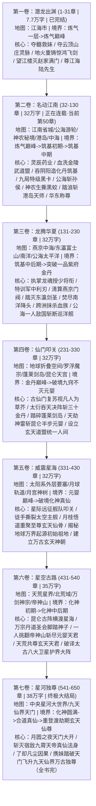

# 《都市：仙尊归来，开局截胡天命机缘》全书终极总纲（两百万字标准长篇）

> **核心定位**：对标《重生之都市修仙》巅峰架构 | 都市修仙 · 无敌降维流 · 极道杀伐果断 · 商业神豪爽文  
> **篇幅规划**：全书共 **七卷**，精准规划 **650 章**，总字数约 **200 - 220 万字**（单章 3000-3500 字标准）  
> **核心主线**：江海崛起 ➔ 名动江南 ➔ 龙腾华夏 ➔ 仙门叩关 ➔ 威震星海 ➔ 星空古路（天荒星界） ➔ 星河独尊（反攻上界重登万界仙尊）

---

## 🗺️ 全书七卷架构与战力/地图递进总览

---

## ⚔️ 力量体系与现实阶级对照表（严格锚定）

| 修仙真实境界 | 对应寿元 | 地球/世俗界对照 | 隐世古仙门对照 | 域外修仙界对照 | 代表性战力表现 |
| :--- | :--- | :--- | :--- | :--- | :--- |
| **炼气期 (1-9层)** | 120 - 150 岁 | 外劲 ➔ 内劲 ➔ 化境宗师 | 外门杂役弟子 | 凡尘散修 | 徒手接子弹、吐气杀人、真气外放十丈 |
| **筑基期 (初/中/后/圆满)** | 200 - 300 岁 | 神境强者 / 当世半神 | 内门精锐弟子 | 宗门真传弟子 | 剑气雷音、肉身破音障、硬抗轻重火炮与反器材重狙 |
| **金丹期 (九品至一品神丹)** | 500 - 800 岁 | 当世神话 / 一人敌国 | 仙门护法 / 长老 | 天宗天骄 / 神子候选 | 虚空生电、神识覆盖百里、一剑分海斩断万吨战舰、肉身硬抗核武 |
| **元婴期 (天君/神君)** | 1000 - 3000 岁 | 人间真仙 / 陆地神仙 | 仙门太上老祖 / 掌教 | 万载天宗之主 / 神君 | 法天象地、掌中神国、滴血重生、焚山煮海 |
| **化神期 (大能/真仙)** | 万载岁月 | 全球神明 / 创世神话 | 飞升上界祖师 | 不朽神教圣祖 / 准帝 | 肉身横渡宇宙真空、只手摘星捉月、一击碎灭小行星 |
| **渡劫仙尊 (玄天道果)** | 寿与天齐 | 宇宙起源万界至高主宰 | 万界源头创世神明 | 九天仙界主宰 / 仙帝 | 执掌天道法则、一念生灭大千世界、万古不磨 |

---

## 📚 各卷阶段大纲速查

### 🟢 第一卷：潜龙出渊（第 1 - 31 章 | 7.7 万字 | 已完结）
* **核心剧情**：仙尊归来夺髓救妹 ➔ 占云顶山庄夺灵脉 ➔ 地火炼飞剑惊鸿 ➔ 望江楼斩杀药王堂供奉灭赵家满门 ➔ 尊江海陆先生。

### 🔵 第二卷：名动江南（第 32 - 130 章 | 32 万字 | 正在连载·当前第50章）
* **核心剧情**：灵辰药业问世 ➔ 收编省城叶家 ➔ 101亿截胡紫灵芝斩雷震霄 ➔ 吞阴阳造化丹踏入【筑基初期】 ➔ 服降九局朱雀小队获特级黑卡 ➔ 秦淮夜雨屠尽江南武道盟 ➔ 公海游轮两指断孙侯合金机械臂、神火焚降头师、一剑分海二百米 ➔ 雷霆全歼黑水战队 ➔ 神农架秘境生撕三百年黑鳞半蛟入【筑基中期】铸青帝琉璃身 ➔ 踏浪维港雷法劈碎九龙风水阵斩三大天师收服港岛 ➔ 华东天穹峰会一剑分江两百米连斩五大神境，华东共尊江南仙师 ➔ 龙魂楚苍山中将递绝密聘书。

### 🟡 第三卷：龙腾华夏（第 131 - 230 章 | 32 万字 | 燕京龙魂与境外争霸）
* **核心剧情**：受聘华夏龙魂荣誉总教官（授少将衔） ➔ 特训龙魂利刃全军大比夺魁 ➔ 因果血线虚空抹杀燕京秦家主使 ➔ 东瀛富士山巅两指折断妖刀村正斩千叶剑圣夺【扶桑神木】 ➔ 南洋玄阳真火焚海灭绝黑巫教 ➔ 欧洲德古拉血族夜袭云顶，小晚玄阴冰魄初显圣，陆辰跨洋虚空一指抹杀血族古堡 ➔ 炼制九转纯阳金丹突破【一品紫府金丹】 ➔ 太平洋公海神战硬抗联合舰队与超音速导弹，一剑斩断万吨巡洋舰一人敌国 ➔ 公海大战震碎深海封印，全球灵气喷发，隐世仙门重临人间。

### 🔴 第四卷：仙门叩关（第 231 - 330 章 | 32 万字 | 隐世古宗门篇）
* **核心剧情**：地球折叠空间全面展开，隐世仙门视凡人为牛羊 ➔ 罗浮魔宗少主逼婚苏清璇，陆辰一掌拍成肉泥、抽魂炼魄悬于地标宣战 ➔ 仙门组建诛凡联盟，陆辰登天施展《太衍吞天决》化万丈星漩吞噬三十金丹 ➔ 踏破蓬莱剑岛熔炼万年剑池 ➔ 直捣昆仑天宫引动元婴天劫轰碎山门，剑斩太上老祖成就【九窍不灭元婴】 ➔ 整合天下仙门设立【玄天道盟】，立小晚为道盟圣女，布设全球【周天星斗大阵】 ➔ 昆仑远古星门暴动，天帝第七远征舰队启航逼近太阳系。

### 🟣 第五卷：威震星海（第 331 - 430 章 | 32 万字 | 地球祖地篇）
* **核心剧情**：域外远征舰队降临太阳系边缘，摧毁冥王星要塞 ➔ 陆辰率玄天道盟与龙魂星际战舰阻击于月球轨道，孤身肉身横渡星海手撕太空主舰 ➔ 斩三大元婴巅峰神将，搜魂揭秘地球乃万界起源【初始祖地】 ➔ 携小晚于月宫月桂树下悟道唤醒祖源，破关踏入【化神真仙】，重聚至强玄天仙骨 ➔ 成立统御全球的【玄天神朝】，地球晋升高等修仙大世界 ➔ 开启昆仑远古星际传送大阵，踏上星空古路。

### ⚪ 第六卷：星空古路（第 431 - 540 章 | 35 万字 | 天荒星界篇）
* **核心剧情**：降临天荒星界（紫穹星域），北荒域客栈立威 ➔ 遗迹夺取九叶玄冰玉髓激活小晚玄阴神道法则 ➔ 万宗丹道圣会虚空炼丹引动九色天劫，丹圣跪拜，翻天掌拍碎三大天宗神子 ➔ 不朽道统【帝神山】集结百位元婴天君围杀，陆辰演化饕餮魔相手撕七十天君、打碎镇宗宝鼎，一剑削平帝神山天门 ➔ 天荒亿万修士共尊【玄天天君】 ➔ 深入古禁地破译太古封印，得知天荒实为守护地球的卫星大阵 ➔ 天帝座下化神大能舰队逼近祖星，陆辰开启星门疾驰回援。

### 👑 第七卷：星河独尊（第 541 - 650 章 | 38 万字 | 重登仙尊终卷）
* **核心剧情**：回援太阳系单手捏爆星际母舰，全歼天帝远征军 ➔ 前往中央星河大世界斩杀天帝余孽道统，聚齐九大混沌灵物 ➔ 昆仑之巅月圆之夜天门大开，宿敌九霄天帝携真仙法身与极道帝兵【九霄斩神刀】降临 ➔ 终极灭世神战！陆辰施展《九天玄天归一剑》引银河星辰为剑胎彻底斩灭天帝真身 ➔ 凡尘因果圆满，父母长生，苏清璇代掌神朝，陆辰携妹踏破天门重返九天仙界，重登万界仙尊之巅（全书大结局）。
